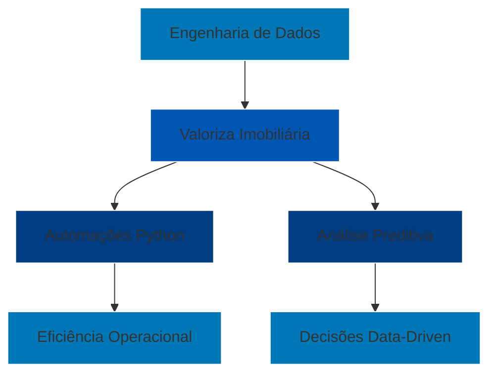

<p align="center">
  
</p>

<div align="center" style="background-color: #0077B6; padding: 2rem; border-radius: 15px; margin: 2rem 0; color: white;">
  <h1>🌟 Bem-vindo ao Nosso Ecossistema Digital</h1>
  <p>Somos a ponte entre tecnologia e sonhos imobiliários. Cada linha de código aqui escrita é um passo para transformar a jornada imobiliária em uma experiência memorável.</p>
</div>

```mermaid
graph TD;
    A[Inovação] --> B[Experiência do Cliente];
    A --> C[Eficiência Operacional];
    B --> D[Plataforma Intuitiva];
    C --> E[Automação Inteligente];
    D --> F[Resultados Excepcionais];
    E --> F;
    style A fill:#0056b3,stroke:#fff,color:#fff
    style B fill:#0077B6,stroke:#fff,color:#fff
    style C fill:#0077B6,stroke:#fff,color:#fff
    style D fill:#0056b3,stroke:#fff,color:#fff
    style E fill:#0056b3,stroke:#fff,color:#fff
    style F fill:#003d82,stroke:#fff,color:#fff
````

---

## 🛠 Stack Tecnológica

<div align="center" style="background-color: #0077B6; padding: 2rem; border-radius: 15px; color: white; margin: 2rem 0;">

| Backend Python                                                                                  | Engenharia de Dados                                                                                 | Análise & BI                                                                             | Infraestrutura                                                                               |
| ----------------------------------------------------------------------------------------------- | --------------------------------------------------------------------------------------------------- | ---------------------------------------------------------------------------------------- | -------------------------------------------------------------------------------------------- |
|              |                  |  |             |
|                 |  |    |           |
|  |                       |                |  |

</div>

---

## 📊 Fluxo de Dados

```mermaid
flowchart LR
    A[Fontes de Dados] --> B{{ETL Python}}
    B --> C[Data Warehouse]
    C --> D[Análise Avançada]
    D --> E[Dashboards Power BI]
    E --> F[Decisões Estratégicas]
    style A fill:#0077B6,stroke:#fff,color:#fff
    style B fill:#0056b3,stroke:#fff,color:#fff
    style C fill:#0077B6,stroke:#fff,color:#fff
    style D fill:#0056b3,stroke:#fff,color:#fff
    style E fill:#0077B6,stroke:#fff,color:#fff
    style F fill:#0056b3,stroke:#fff,color:#fff
```

---

## 🏆 Estatísticas Técnicas

<div align="center" style="background-color: #0077B6; padding: 2rem; border-radius: 15px; color: white; margin: 2rem 0;">

🛑 Os repositórios da Valoriza são privados, por isso estatísticas públicas como linguagens mais usadas não aparecem corretamente.

> Desenvolvemos majoritariamente em **Python e SQL (86%)**, com projetos complementares em **C++** e **JavaScript**.

[](https://git.io/streak-stats)

[](https://github.com/ryo-ma/github-profile-trophy)

</div>

---

## 🚀 Projetos em Destaque

<div align="center" style="background-color: #0056b3; padding: 2rem; border-radius: 15px; color: white; margin: 2rem 0;">

| Projeto         | Tecnologias                                                                                                                                                                              | Impacto                                  |
| --------------- | ---------------------------------------------------------------------------------------------------------------------------------------------------------------------------------------- | ---------------------------------------- |
| **Kenlo MVP**   |        | 92% de redução no tempo de processamento |
| **Hub de KPIs** |   | 40% mais decisões baseadas em dados      |
| **Valoriza AI** |           | +120% de engajamento de leads            |

</div>

---

## 👨‍💻 Sobre o Desenvolvedor

<div align="center" style="background-color: #0077B6; padding: 2rem; border-radius: 15px; color: white; margin: 2rem 0;">
  
  <h3>Kaymmi Antunes</h3>
  <p>Engenheiro de Dados | Cientista de Dados | Desenvolvedor Python</p>

🔭 Desenvolvendo soluções para inteligência imobiliária
🌱 Explorando machine learning e automações no setor
📬 Contato: [valorizabidados@outlook.com](mailto:valorizabidados@outlook.com)

</div>

---

## 📌 Diagrama Profissional



---

<p align="center">
  
</p>

<p align="center">
  <a href="https://www.valorizaimobiliaria.com.br" target="_blank">
    
  </a>
  <a href="mailto:valorizabidados@outlook.com">
    
  </a>
  <a href="https://www.linkedin.com/company/valoriza-assessoria-imobiliária/">
    
  </a>
</p>
```


