# 🏡✨ Valoriza Imobiliária - Plataforma Tecnológica

<p align="center">
  <a href="https://www.valorizaimobiliaria.com.br/" target="_blank">
    
  </a>
</p>

<div align="center">
  
  
  
  
  

</div>

## 🌟 Bem-vindo ao Nosso Ecossistema Digital

```mermaid
graph TD;
    A[Inovação] --> B[Experiência do Cliente];
    A --> C[Eficiência Operacional];
    B --> D[Plataforma Intuitiva];
    C --> E[Automação Inteligente];
    D --> F[Resultados Excepcionais];
    E --> F;
```



Somos a ponte entre tecnologia e sonhos imobiliários. Cada linha de código aqui escrita é um passo para transformar a jornada imobiliária em uma experiência memorável.

## 🚀 Demonstração da Plataforma

https://user-images.githubusercontent.com/12345678/188540854-15091a13-728b-4c17-8e62-dd07ef28c89b.mp4

*(Vídeo mostrando a navegação fluida pela plataforma com transições suaves e microinterações)*

## 🛠 Stack Tecnológica

<div align="center">
  
  | Frontend               | Backend            | DevOps             | Dados               |
  |------------------------|--------------------|--------------------|---------------------|
  |  |  |  |  |
  |  |  |  |  |
  |  |  |  |  |

</div>

## 👨‍💻 Time de Desenvolvimento

<div align="center">
  <div style="display: flex; justify-content: center; gap: 30px; flex-wrap: wrap; margin: 40px 0;">
    <div style="text-align: center;">
      
      <h3>Kaymmi Antunes</h3>
      <p>Engenheiro de Dados & DevOps</p>
      <div>
        <a href="#"></a>
        <a href="#"></a>
      </div>
    </div>
    <!-- Adicione mais membros do time aqui -->
  </div>
</div>

## 📊 Fluxo de Dados

```mermaid
flowchart LR
    A[Fontes de Dados] --> B{{ETL}}
    B --> C[Data Warehouse]
    C --> D[Visualização]
    D --> E[Tomada de Decisão]
    style A fill:#f9f9f9,stroke:#007bff
    style B fill:#e3f2fd,stroke:#007bff
    style C fill:#f9f9f9,stroke:#007bff
    style D fill:#e3f2fd,stroke:#007bff
    style E fill:#f9f9f9,stroke:#007bff
```



## 📂 Estrutura do Projeto

```
tech-platform/
├── frontend/           # Aplicações React/Next.js
│   ├── public/         # Assets estáticos
│   └── src/            # Código fonte
│       ├── components/ # Componentes UI
│       └── pages/      # Rotas da aplicação
├── backend/            # API e serviços
│   ├── src/            # Código fonte Node.js/NestJS
│   └── tests/          # Testes automatizados
├── data-pipeline/      # Processamento de dados
│   ├── etl/            # Scripts de transformação
│   └── models/         # Modelos de dados
└── infrastructure/     # Configuração de infraestrutura
    ├── aws/            # Templates CloudFormation
    └── terraform/      # Configuração IaC
```

## 🌈 Design System

<div align="center">
  <div style="display: flex; justify-content: center; gap: 10px; margin: 20px 0;">
    <div style="width: 50px; height: 50px; background: #007bff; border-radius: 8px; display: flex; align-items: center; justify-content: center; color: white; font-weight: bold;">Primary</div>
    <div style="width: 50px; height: 50px; background: #6c757d; border-radius: 8px; display: flex; align-items: center; justify-content: center; color: white; font-weight: bold;">Secondary</div>
    <div style="width: 50px; height: 50px; background: #28a745; border-radius: 8px; display: flex; align-items: center; justify-content: center; color: white; font-weight: bold;">Success</div>
    <div style="width: 50px; height: 50px; background: #343a40; border-radius: 8px; display: flex; align-items: center; justify-content: center; color: white; font-weight: bold;">Dark</div>
  </div>
  
  <p>Fonte principal: <span style="font-family: 'Inter', sans-serif; font-weight: 500;">Inter Medium</span></p>
</div>

## 🚀 Como Contribuir

1. **Fork** este repositório
2. Crie uma branch (`git checkout -b feature/AmazingFeature`)
3. Commit suas mudanças (`git commit -m 'Add some AmazingFeature'`)
4. Push para a branch (`git push origin feature/AmazingFeature`)
5. Abra um **Pull Request**

<div align="center" style="margin-top: 40px;">
  <a href="https://github.com/valorizaimobiliaria/tech-platform/graphs/contributors">
    
  </a>
</div>

## 📬 Contato

<div align="center">
  <a href="mailto:contato@valorizaimobiliaria.com.br">
    
  </a>
  <a href="https://www.valorizaimobiliaria.com.br">
    
  </a>
  <a href="#">
    
  </a>
</div>

<p align="center" style="margin-top: 40px;">
  
</p>

---

✨ *Transformando o mercado imobiliário através de código e inovação.* ✨
