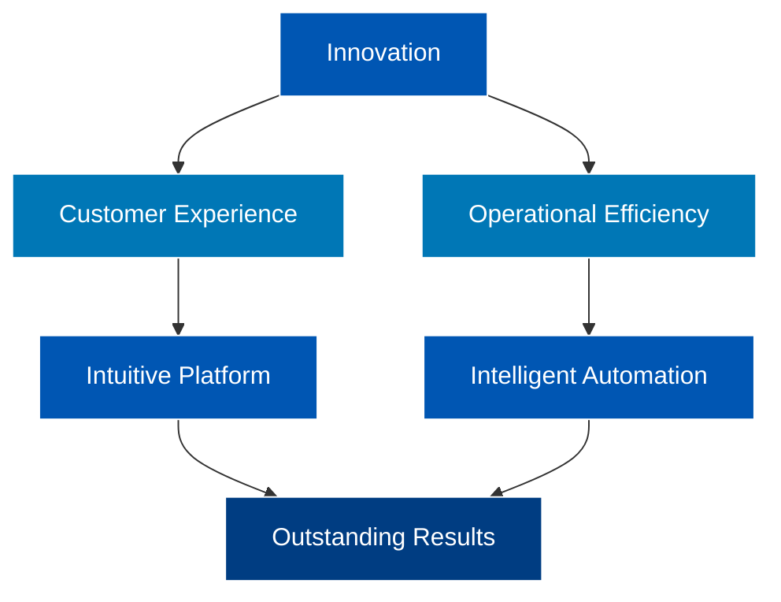
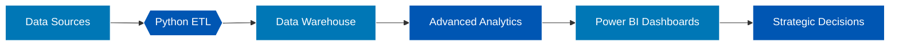
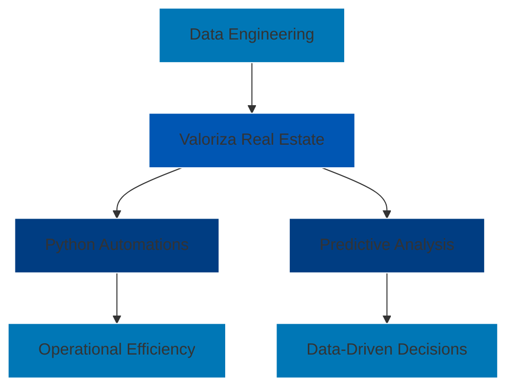

  

  <h1>🌟 Welcome to Our Digital Ecosystem</h1>
  
We are the bridge between technology and real estate goals. Every line of code here is a step towards transforming the real estate journey into a memorable experience.

## 🛠 Stack Tecnológica

| Backend Python                                                                                  | Engenharia de Dados                                                                                 | Análise & BI                                                                             | Infraestrutura                                                                               |
| ----------------------------------------------------------------------------------------------- | --------------------------------------------------------------------------------------------------- | ---------------------------------------------------------------------------------------- | -------------------------------------------------------------------------------------------- |
|              |                  |  |             |
|                 |  |    |           |
|  |                       |                |  |

## 📊 Data Flow

markdown
## 🏡 Valoriza Real Estate | Technology Hub

  

## 📊 Technology Landscape

📌 Valoriza's repositories are private, so automatic GitHub language statistics aren't displayed correctly.

🔍 However, our stack is clear, active, and consolidated across multiple projects:

<table>
  <tr>
    <th>🧠 Core Languages</th>
    <th>⚙️ Technical Processes</th>
    <th>📊 Visualization & BI</th>
  </tr>
  <tr>
    <td align="center">
      
       
      
       
      
    </td>
    <td align="center">
      
       
      
       
      
    </td>
    <td align="center">
      
       
      
       
      
       
      
    </td>
  </tr>
</table>

🔧 Stack focused on reliable automations, business analysis, and market intelligence.  
📊 Data is processed, validated, consolidated and versioned automatically.

## 🚀 Featured Projects

| Project        | Technologies                                                                                                                                                                              | Impact                               |
| -------------- | ---------------------------------------------------------------------------------------------------------------------------------------------------------------------------------------- | ------------------------------------ |
| **Kenlo MVP**  |        | 92% processing time reduction        |
| **KPI Hub**    |   | 40% more data-driven decisions       |
| **Valoriza AI**|           | +120% lead engagement                |

## 📌 Professional Diagram

👨‍💻 About Our Team

  <h3>Kaymmi Antunes</h3> 
Business Intelligence | Data Scientist | Python Developer

🔭 Developing solutions for real estate intelligence
🌱 Exploring Data, AI and automations in the sector

📬 Contact: valorizabidados@outlook.com

🐍 Contribution Snake Game

<picture> <source media="(prefers-color-scheme: light)" srcset="https://raw.githubusercontent.com/Platane/snk/output/github-contribution-grid-snake.svg?color_snake=%230077B6&color_dots=%23001C55%2C%23003f88%2C%230056b3%2C%230077B6%2C%2300a0e9&text=TOGETHER+WE+ADD%0AIN+SYNERGY+WE+CONQUER%0AVALORIZA+REAL+ESTATE">  </picture>
 🎯 Our daily tech journey visualized as a game  💡 Each step represents a project, a delivery, a solution 

https://raw.githubusercontent.com/Platane/snk/output/github-contribution-grid-snake-dark.gif?color_snake=%25230077B6&color_dots=%2523001C55%252C%2523003f88%252C%25230056b3%252C%25230077B6%252C%252300a0e9&text=TOGETHER+WE+ADD%250AIN+SYNERGY+WE+CONQUER%250AVALORIZA+REAL+ESTATE

  

    

