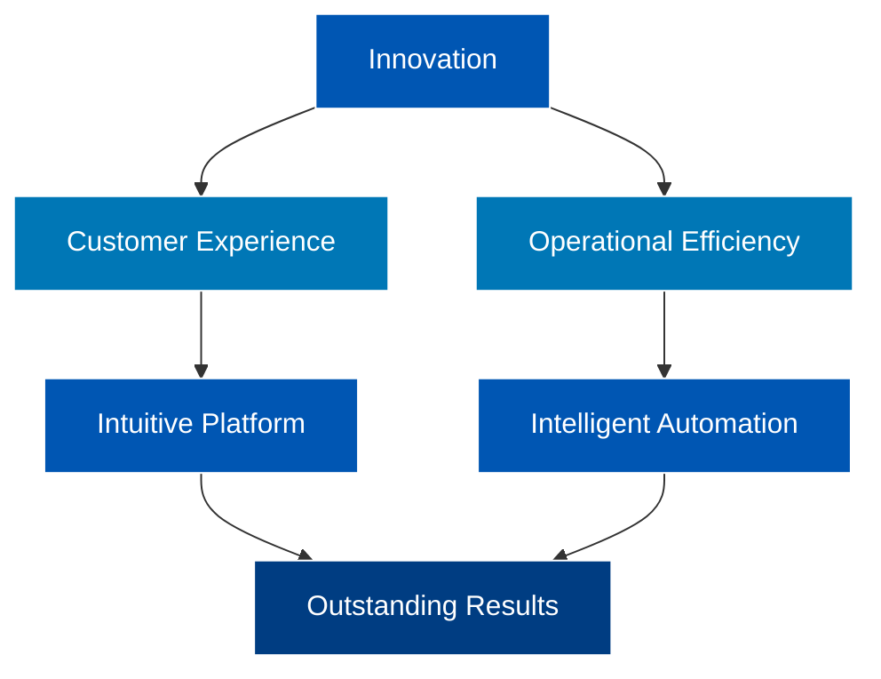

  

  <h1>🌟 Welcome to Our Digital Ecosystem</h1>
  
We are the bridge between technology and real estate goals. Every line of code here is a step towards transforming the real estate journey into a memorable experience.

## 🛠 Tech Stack

The same stack applies. See the original README for visuals.

## 📊 Data Flow

## 📌 Technological Landscape of Valoriza

- All repositories are private.
- Our stack is active, standardized, and present in multiple scalable projects.
- Focused on automation, commercial intelligence, and lead performance.

## 🚀 Featured Projects

| Project         | Technologies | Impact |
|-----------------|--------------|--------|
| **Kenlo MVP**   | Python + Playwright | 92% reduction in processing time |
| **KPI Hub**     | Power BI + PostgreSQL | 40% more data-driven decisions |
| **Valoriza AI** | TensorFlow + Flask | +120% lead engagement |

## 👨‍💻 About the Team

**Kaymmi Antunes**  
Business Intelligence | Data Scientist | Python Developer  
📬 Contact: [valorizabidados@outlook.com](mailto:valorizabidados@outlook.com)

## 🐍 Contribution Snake Game

Contributions visualized as progress and delivery — code as impact.

---

  
  
  

